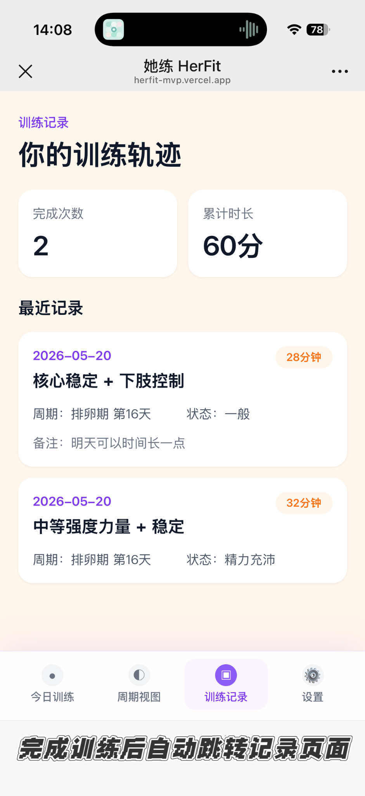
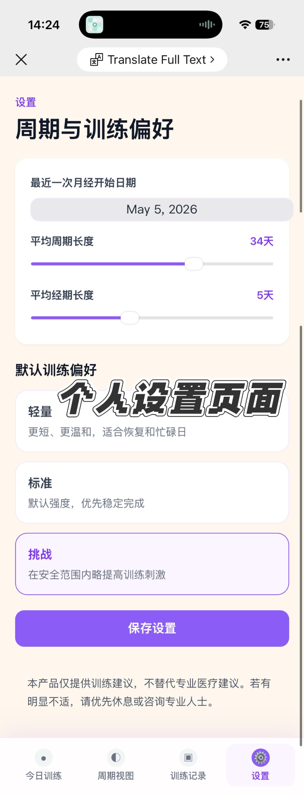

# HerFit｜AI 驱动的女性周期友好训练助手

HerFit 是一个面向女性健身用户的 AI-powered daily workout decision assistant，基于用户的生理周期阶段、身体状态和训练场景，生成更适合当天执行的个性化训练建议。

> 核心逻辑：周期阶段 × 身体状态 × 训练场景

---

## Demo

- Online Demo：https://herfit-mvp.vercel.app/
- GitHub Repository：https://github.com/youluwei1125-design/herfit-mvp
- Current Version：V0.1 MVP
- Status：已完成 MVP 并部署至 Vercel，已接入 Claude Sonnet API 实时生成训练建议

---

## Preview

> 以下截图展示 HerFit 当前 MVP 的核心使用流程。完整交互体验请访问 Online Demo。

### 1. 新手引导流程

Onboarding 通过多步问题收集用户的训练目标、训练水平、身体数据、周期信息和当前状态，为后续个性化推荐提供上下文。


### 2. 今日训练核心链路

HerFit 将周期状态、用户当日身体感受与训练计划结合，形成从“状态选择”到“训练执行”再到“训练反馈”的完整使用路径。


### 3. 周期视图

周期视图展示用户当前所处周期阶段、本周期关键日期和不同阶段的训练建议，使训练安排能够与身体节奏保持一致。


### 4. 训练记录

训练记录页展示用户的完成次数、累计时长和最近训练记录，使训练结果能够被沉淀下来，为后续个性化推荐和计划调整提供数据基础。



### 5. 个性化设置与安全声明

设置页支持用户查看和调整周期信息与训练偏好，并明确提示产品仅提供训练建议，不替代专业医疗建议。



---

## Project Overview

HerFit 关注的是女性健身中的一个具体决策问题：

> 我今天的身体状态适合做什么训练？

传统健身产品通常更关注训练记录、动作库和计划执行；周期类产品则更关注经期记录、症状追踪和健康内容。HerFit 尝试连接这两个场景，将用户的周期阶段、身体状态和训练条件转化为更具体、更可执行的每日训练建议。

当前版本是一个可交互 MVP，重点验证 AI 在女性训练决策场景中的产品价值。

---

## Key Features

### 1. Daily Workout Recommendation

根据用户当天状态生成训练建议，包括：

- 今日推荐训练类型
- 推荐训练强度
- 建议训练时长
- 具体动作组合
- 推荐理由
- 安全提醒
- 替代方案

### 2. Cycle-aware Training Logic

根据不同周期阶段调整训练方向：

- 月经期：恢复、舒缓、低强度
- 卵泡期：可适当提升训练强度
- 排卵期：根据状态推荐更积极训练
- 黄体期：低冲击、可调整、避免过度消耗
- 周期未知：更多基于当天身体状态判断

### 3. Safety-first Recommendation

当用户反馈明显不适时，系统会优先降低训练强度，避免高冲击、高强度或强腹压训练。

例如：

- 痛经明显时，避免 HIIT、跳跃和高强度核心训练；
- 严重疲劳时，推荐恢复、拉伸或低强度活动；
- 头晕、明显疼痛或异常不适时，建议休息或寻求专业建议。

### 4. AI-assisted MVP Development

训练建议通过 Next.js API Route 调用 Claude Sonnet API 实时生成，输入为用户周期阶段、身体状态等 6 个结构化字段，输出为 JSON 格式的完整训练方案。

本项目使用 ChatGPT / Codex / Cursor 辅助完成：

- 产品定位梳理
- 竞品分析
- AI 推荐逻辑设计
- Prompt 文档整理
- 技术说明文档
- 前端 MVP 开发与迭代

---

## AI Logic

HerFit 的 AI 推荐逻辑采用：

> Rule-based Safety Filter + AI-generated Workout Recommendation  
> 规则型安全过滤 + AI 生成式训练推荐

也就是说，系统不会直接让 AI 随机生成训练内容，而是先通过规则判断用户当前状态是否适合训练、是否需要降低强度，再在安全边界内生成个性化训练建议。（当前使用 Claude Sonnet API，通过 Next.js API Route 代理调用）

整体流程为：

```text
用户输入周期阶段、身体状态和训练场景
        ↓
规则型安全过滤
        ↓
周期阶段与训练强度判断
        ↓
AI 生成训练建议
        ↓
输出推荐理由、安全提醒和替代方案
```

详细 AI 逻辑请查看：

- [`AI_LOGIC.md`](./AI_LOGIC.md)

---

## Project Documents

| Document | Description |
|---|---|
| [`AI_LOGIC.md`](./AI_LOGIC.md) | AI 推荐逻辑说明，包括输入字段、安全过滤、输出结构和产品边界 |
| [`PRODUCT_PRD.md`](./PRODUCT_PRD.md) | 产品说明 / 轻量版 PRD，包括目标用户、用户痛点、MVP 范围和用户流程 |
| [`COMPETITIVE_ANALYSIS.md`](./COMPETITIVE_ANALYSIS.md) | 竞品分析文档，覆盖 Strong、FitrWoman、Flo 等产品 |
| [`PROMPTS_v0.md`](./PROMPTS_v0.md) | Prompt 工程与 AI 协作说明 |
| [`TECH_GUIDE_v0.md`](./TECH_GUIDE_v0.md) | 技术实现说明，包括技术栈、项目结构和部署方式 |

---

## Tech Stack

> 可根据当前项目实际情况修改

- React
- TypeScript
- Tailwind CSS
- Vite
- AI：Claude API (claude-sonnet-4-20250514)
- 存储：localStorage（用户数据本地持久化）
- Vercel

---

## Project Structure

```text
HerFit/
├── README.md
├── AI_LOGIC.md
├── PRODUCT_PRD.md
├── COMPETITIVE_ANALYSIS.md
├── PROMPTS_v0.md
├── TECH_GUIDE_v0.md
├── package.json
├── public/
│   └── screenshots/
│       ├── onboarding-flow.png
│       ├── core-user-journey.png
│       ├── cycle-view.png
│       ├── workout-records.png
│       └── personalized-settings-safety.png
└── src/
```

---

## How to Run Locally

```bash
npm install
npm run dev
```

---

## Current Status

Current version:

> V0.1 MVP

当前版本重点完成：

- 新手引导流程
- 今日训练推荐页面
- 用户状态输入
- 周期视图
- 周期友好训练建议展示
- 搜索跟练视频入口
- 训练完成反馈
- 训练记录沉淀
- 个性化设置与安全声明
- 基础前端交互原型

当前版本主要验证：

- 用户是否需要基于周期和身体状态的训练建议；
- “周期阶段 × 身体状态 × 训练场景”的推荐逻辑是否成立；
- AI 是否适合承担每日训练决策辅助角色；
- 从状态输入、训练执行到记录沉淀的核心用户路径是否顺畅。

---

## Current Limitations

- 当前版本通过 Next.js API Route 代理调用 Claude Sonnet API 生成训练建议，规则型安全过滤在前端执行。
- 当前版本暂不包含账号系统、长期云端数据存储和真实医疗级健康判断。
- 视频入口目前仍以关键词搜索跳转为主，后续计划升级为精选视频库与结构化标签匹配。
- HerFit 不提供医学诊断，也不能替代医生、康复师或专业教练建议。

---

## Next Steps

### V0.2｜周期 × 训练记录日历

- 增加日历视图，将生理周期、症状、出血情况和训练记录整合在同一界面中。
- 支持用户实时添加每日身体状态、训练完成情况和备注。
- 为后续个性化推荐和计划调整建立数据基础。

### V0.3｜周 / 月训练计划视图

- 从单日训练推荐扩展为一周 / 一个月训练计划展示。
- 展示每天的训练类型、强度、时长、完成状态和周期适配说明。
- 帮助用户理解每日训练如何服务于更长期的训练目标。

### V0.4｜请假与智能重排

- 支持用户临时请假或跳过当天训练。
- 用户回归后，根据最新周期阶段、身体状态和训练目标重新调整后续计划。
- 提供轻量恢复、跳过继续、顺延计划等重排策略。

### V0.5｜精选视频推荐

- 建立带有结构化标签的 B 站精选训练视频库。
- 根据训练类型、强度、时长、器械和用户身体状态匹配具体视频。
- 推荐 1-3 个可直接跳转的跟练视频，降低用户筛选成本。

### V0.6｜科普知识增强

- 增加与推荐结果相关的轻量科普内容。
- 解释不同周期阶段、身体状态与训练强度之间的关系。
- 通过“为什么这样推荐”提升用户对 AI 建议的理解和信任。

---

## Product Boundary

HerFit 不是医疗产品，也不能替代医生、康复师或专业教练的建议。

HerFit 不提供医学诊断，也不声称可以治疗任何经期症状或健康问题。

如果用户出现严重疼痛、头晕、异常出血、持续不适或其他异常症状，应停止训练并寻求专业医疗建议。

---

## One-line Summary

HerFit helps women make better daily workout decisions by turning cycle phase, physical state and workout context into personalized, explainable and safer training recommendations.
